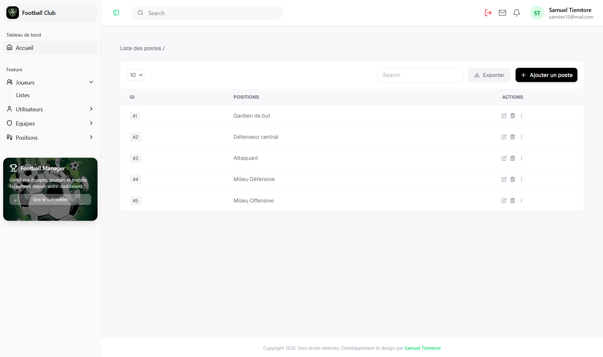
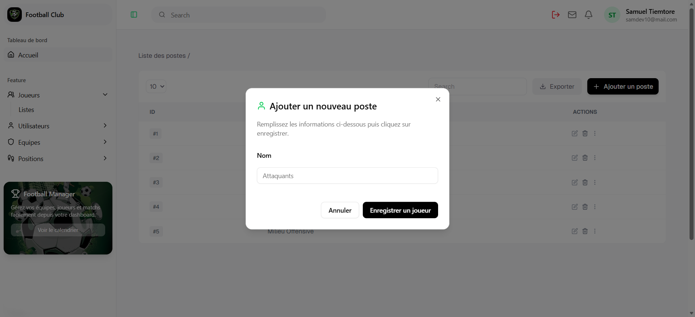
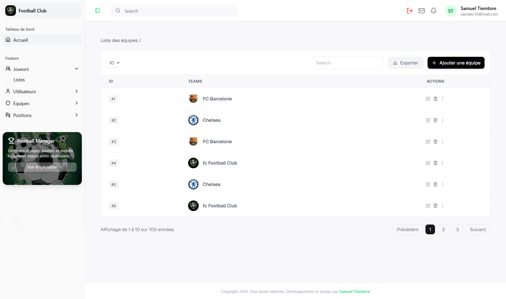
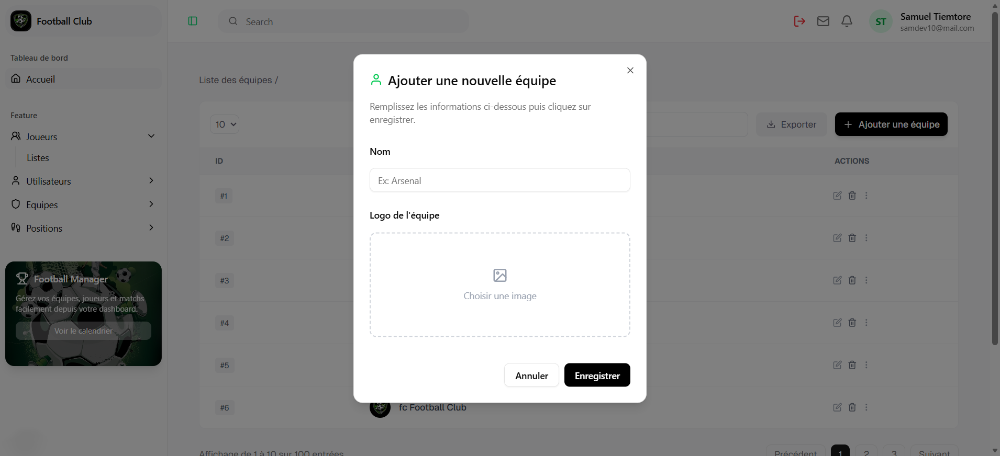

# Football Club Dashboard (NextJS 16)

Dashboard fullstack pour la gestion d’un club de football.
Construit avec Next.js et connecté à une API backend NestJS + Prisma.


**Note** : Il s’agit d’un prototype actuellement en développement. compatible mobile, tablette et PC

## Stack technique

### Frontend
- Next.js 16 (App Router)
- React
- TypeScript
- Tailwind CSS
- Framer motion
- Shadcn UI

### Backend
- NestJS 
- PostgreSQL
- Prisma 

### Autres
- Axios
- JWT Authentication
- cookies HttpOnly
- React query hooks


##  Fonctionnalités 

- Interface responsive avec TailwindCSS 
- Connexion
- Inscription
- mot de passe oublié 
- réinitialisation du mot de passe 
- verification code ADMIN/SUPERADMIN 
- verification-email UTILISATEURS 
- Export PDF avec pdfmake 
- Pop Form add joueurs 
- Dashboard main 
- Tableau des joueurs 
- Tableau des utilisateurs 
- Tableau des postes 
- Tableau des équipes 
- Utilisateurs Multi-Tenant
- Gestion des joueurs, équipes et postes
- Authentification sécurisée JWT + Refresh Token + verification 2fa + Cookies HttpOnly, connexion API externe
- Authentification securiser google avec OAuth
- Upload d'images (joueurs, logos team)

## Fonctionnalités à venir (feature)
 
- Gestion des utilisateurs (connexion a mon API) (dev en cours...)
- Ajout d'autre module metier
- etc...


## Screenshots

| Connexion | Inscription |
|-------|---------|
|  |  |
| Vérification | Vérifier l’email |
|  |  |
| Mot de passe oublié | Réinitialiser le mot de passe |
|  |  |
| Tableau de bord | Tableau des joueurs |
|  |  |
| Ajouter un joueur | Tableau des utilisateurs |
|  |  |
| Ajouter un utilisateur | Supprimer un utilisateur |
|  |  |
| Modifier un utilisateur | Tableau des postes |
|  |  |
| Ajouter un poste | Tableau des équipes |
|  |  |
| Ajouter une équipe |
|  |


## Déploiement

- Frontend : [https://dashboard-football-club.vercel.app](https://dashboard-football-club.vercel.app) 
- Backend : [https://api-football-gfpz.onrender.com](https://api-football-gfpz.onrender.com) 
- Base de données: PostgreSQL deployer sur **Neon**
- Une documentation Swagger est disponible: https://api-football-gfpz.onrender.com/docs


## Architecture du projet


```bash

assets/              # screenshots pour le README

public/
└── assets/          # images et ressources utilisées par l'application

src/
├── app/             # routing et pages Next.js
├── features/        # fonctionnalités (auth, dashboard, players, team, user, position)
├── components/      # composants UI réutilisables
├── hooks/           # hooks React personnalisés
├── providers/
├── lib/             # utilitaires et services

types/                # types TypeScript globaux 

README.md            # documentation du projet

```
## Installation du projet

```bash

git clone https://github.com/SamiTelo/dashboard-football-club
cd dashboard-football-club
npm install
npm run dev

```
##  Auteur
- **Tiemtore Samuel**
- Email: [samueltiemtore10@gmail.com](mailto:samueltiemtore10@gmail.com)

## Licence
Ce projet est sous licence MIT.
