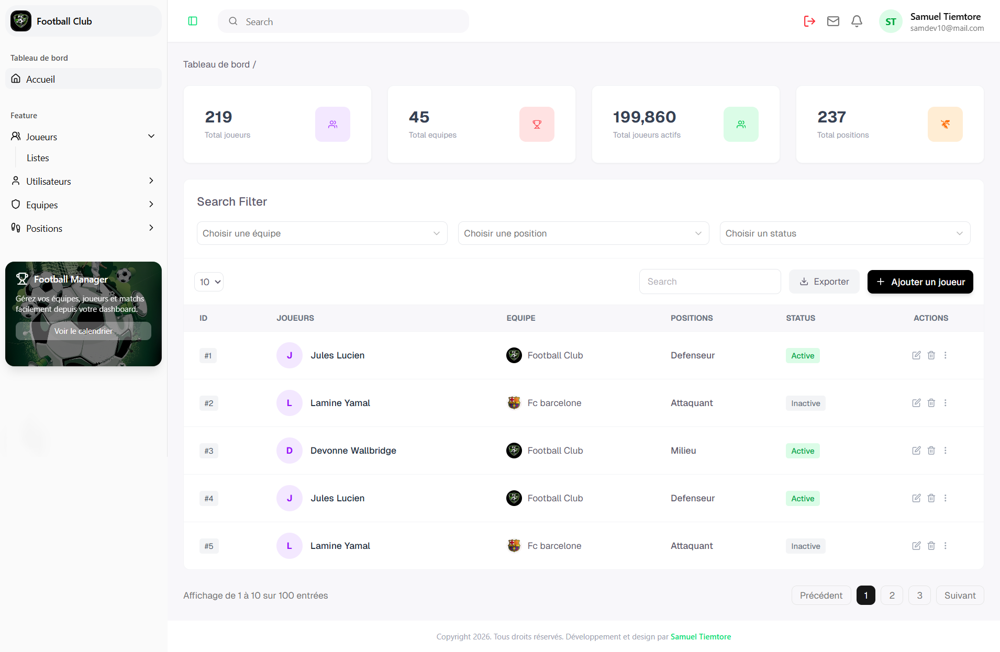

# Football Club Dashboard

Dashboard frontend pour la gestion complète du Football Club, de l'API-football backend NestJS + Prisma.


**Note** : Il s’agit d’un prototype actuellement en développement. compatible mobile, tablette et PC

## Stacks

- Next.js 14
- TypeScript
- TailwindCSS
- Framer Motion


##  Fonctionnalités 

- Interface responsive avec TailwindCSS (OK)
- Page login (OK)
- Page register (OK)
- Page mot de pase oublié (OK)
- Page réinitialisation de mot de pase (OK)
- Page verification code OTP (OK)
- Export PDF player avec pdfmake (OK)
- Pop Form add player (OK)
- Dashboard (OK)
- Dashboard page player (OK)

## Fonctionnalités à venir (feature)

- Dashboard page, team, user (dev en cours...)
- Authentification sécurisée JWT + Refresh Token  (connexion a mon API)
- Gestion des joueurs, équipes et postes (connexion a mon API)
- Upload d'images (joueurs, logos)
- etc...


## Screenshots

| Login | Register |
|-------|---------|
|  |  |
| Verification | Verify Mail |
|  |  |
| Forgot Password | Reset Password |
|  |  |
| Dashboard | Dashboard player |
|  |  |
| pop add player |
|  |

```bash
git clone https://github.com/SamiTelo/dashboard-football-club
cd dashboard-football-club
npm install
npm run dev

```
##  Auteur
**Tiemtore Samuel**
Email: [samueltiemtore10@gmail.com](mailto:samueltiemtore10@gmail.com)