# Football Club Dashboard

Dashboard frontend pour la gestion d’un club de football.
Construit avec Next.js et connecté à une API backend NestJS + Prisma.


**Note** : Il s’agit d’un prototype actuellement en développement. compatible mobile, tablette et PC

## Tech Stack

**Framework**
- Next.js 14

**Language**
- TypeScript

**Styling**
- Tailwind CSS
- shadcn/ui

**Animation**
- Framer Motion


##  Fonctionnalités 

- Interface responsive avec TailwindCSS (OK)
- Page login (OK)
- Page register (OK)
- Page mot de passe oublié (OK)
- Page réinitialisation du mot de passe (OK)
- Page verification code OTP (OK)
- Export PDF player avec pdfmake (OK)
- Pop Form add player (OK)
- Dashboard (OK)
- Dashboard page player (OK)

## Fonctionnalités à venir (feature)

- Dashboard page, team, user (dev en cours...)
- Authentification sécurisée JWT + Refresh Token  (connexion a mon API)
- Gestion des joueurs, équipes et postes (connexion a mon API)
- Upload d'images (joueurs, logos)
- etc...


## Screenshots

| Connexion | Inscription |
|-------|---------|
| 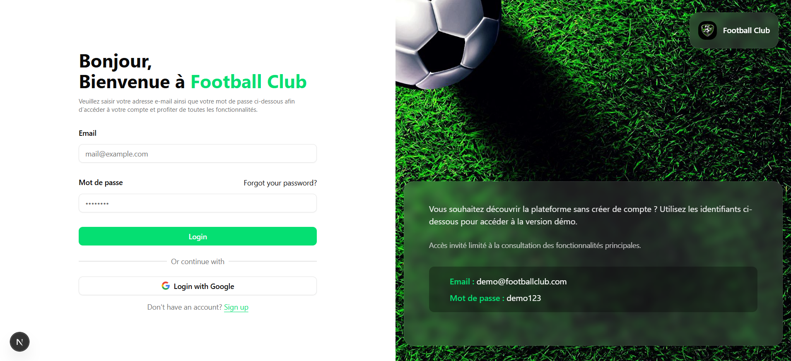 | 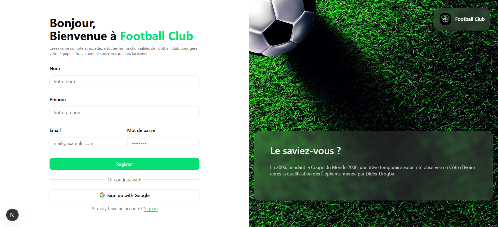 |
| Vérification | Vérifier l’email |
| 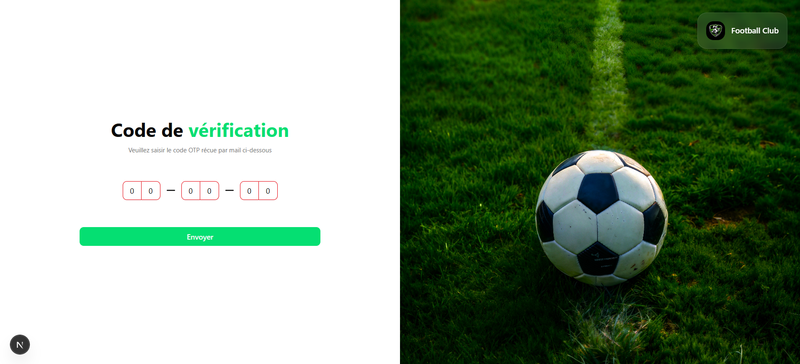 | 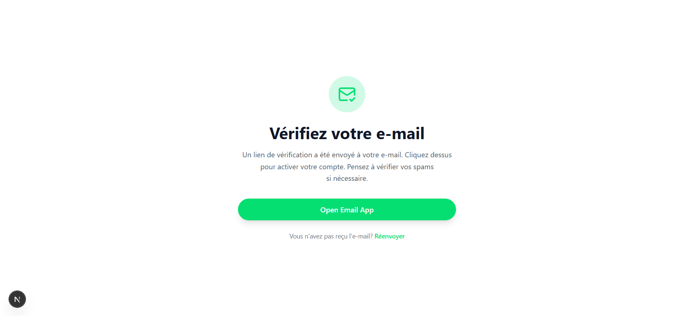 |
| Mot de passe oublié | Réinitialiser le mot de passe |
| 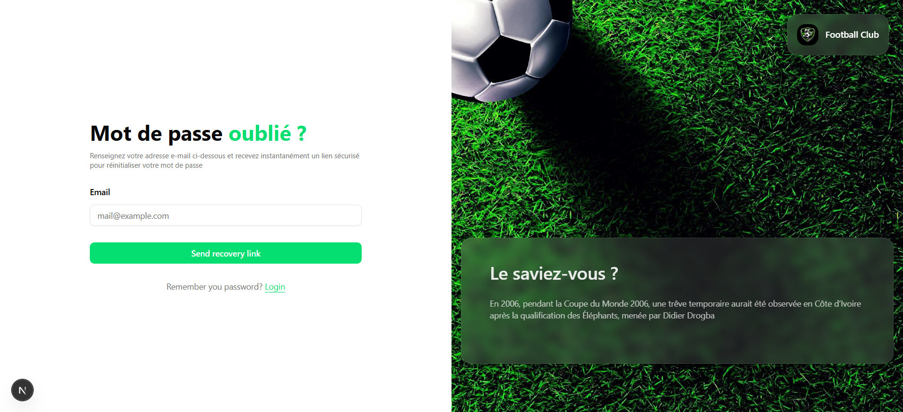 | 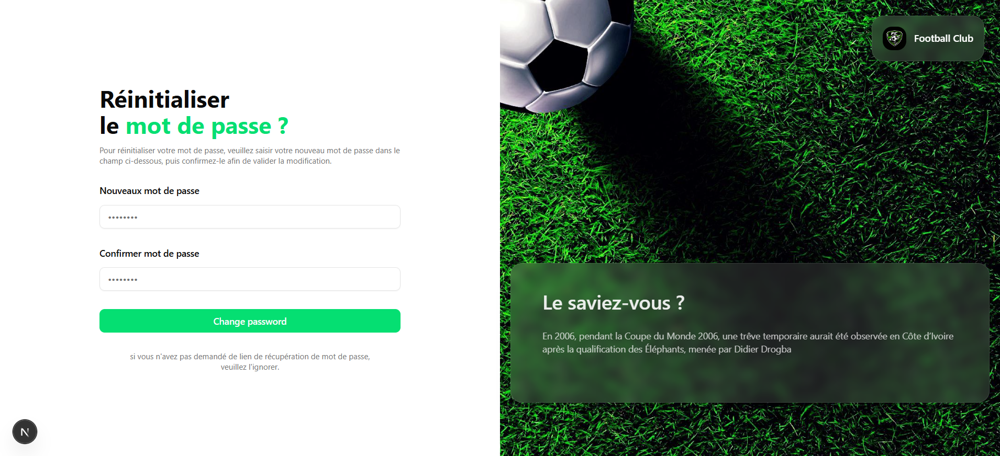 |
| Tableau de bord | Tableau des joueurs |
| 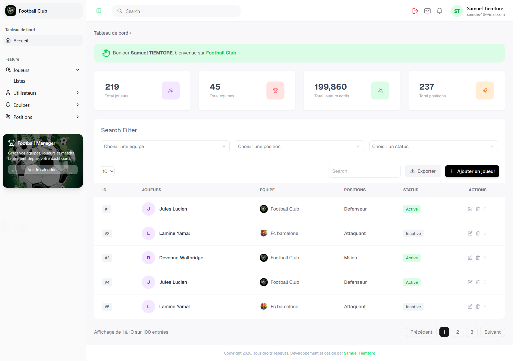 | 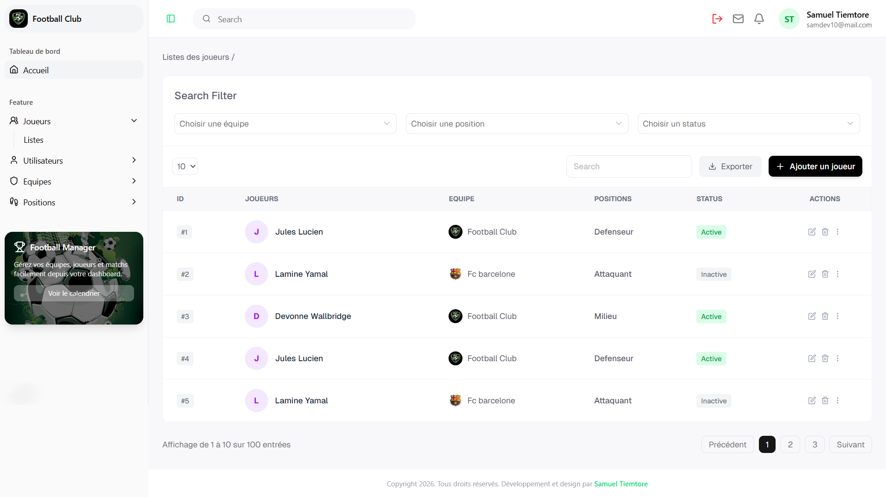 |
| Ajouter un joueur | Tableau des utilisateurs |
| 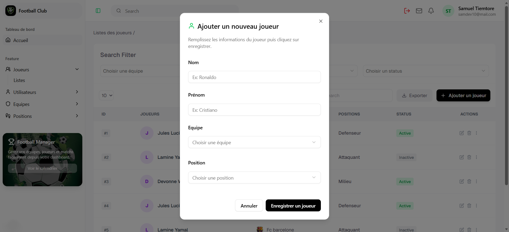 | 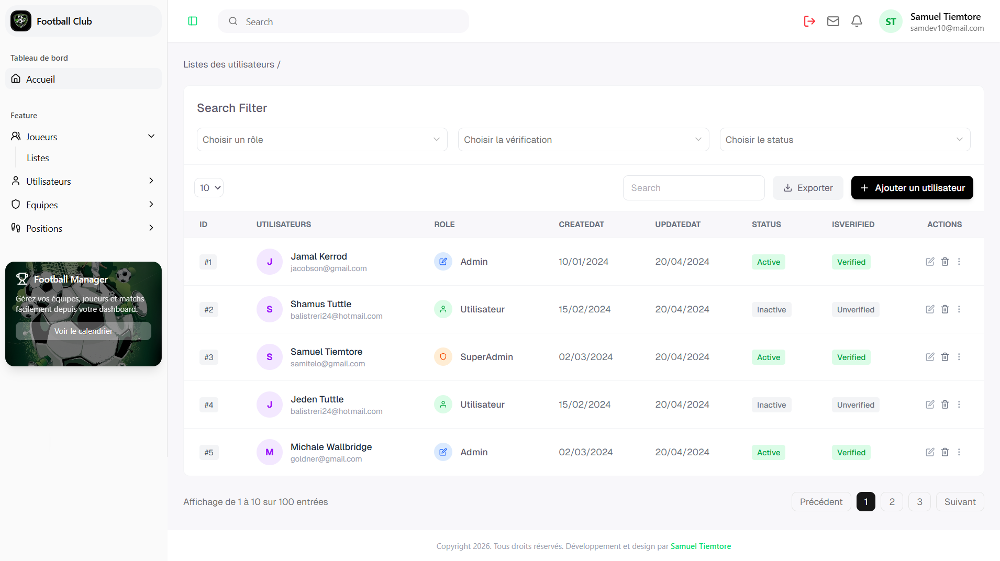 |
| Ajouter un utilisateur | Supprimer un utilisateur |
| 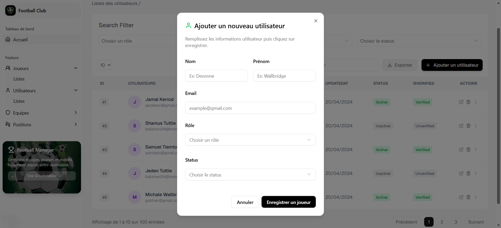 | 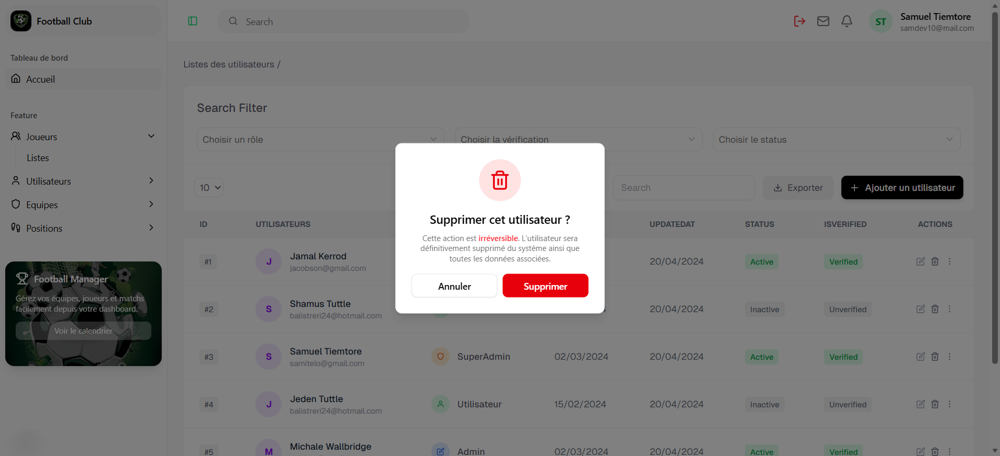 |
| Modifier un utilisateur |
| 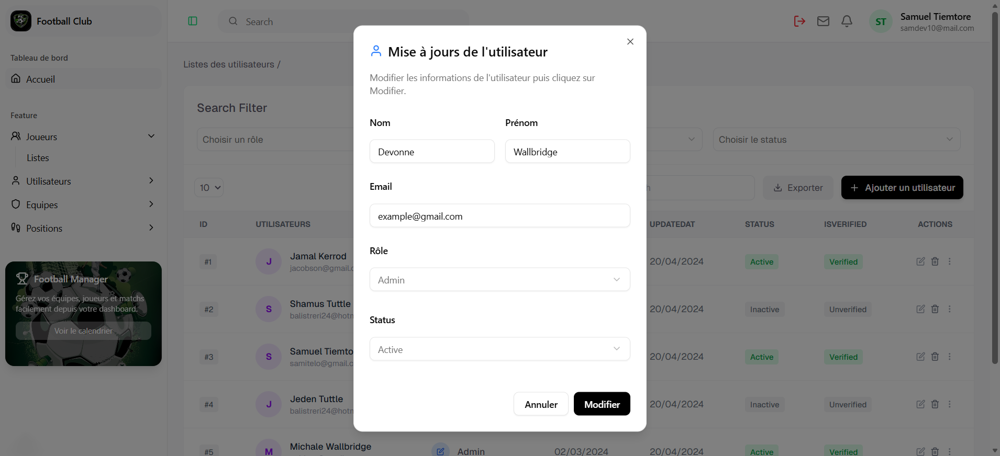 |


## Architecture du projet


```bash

assets/              # screenshots pour le README

public/
└── assets/          # images et ressources utilisées par l'application

src/
├── app/             # routing et pages Next.js
├── features/        # fonctionnalités (auth, dashboard, players, team, user, position)
├── components/      # composants UI réutilisables
├── hooks/           # hooks React personnalisés
├── lib/             # utilitaires et services

types/               # types TypeScript globaux

README.md            # documentation du projet

```
## Installation du projet

```bash

git clone https://github.com/SamiTelo/dashboard-football-club
cd dashboard-football-club
npm install
npm run dev

```

##  Auteur
**Tiemtore Samuel**
Email: [samueltiemtore10@gmail.com](mailto:samueltiemtore10@gmail.com)